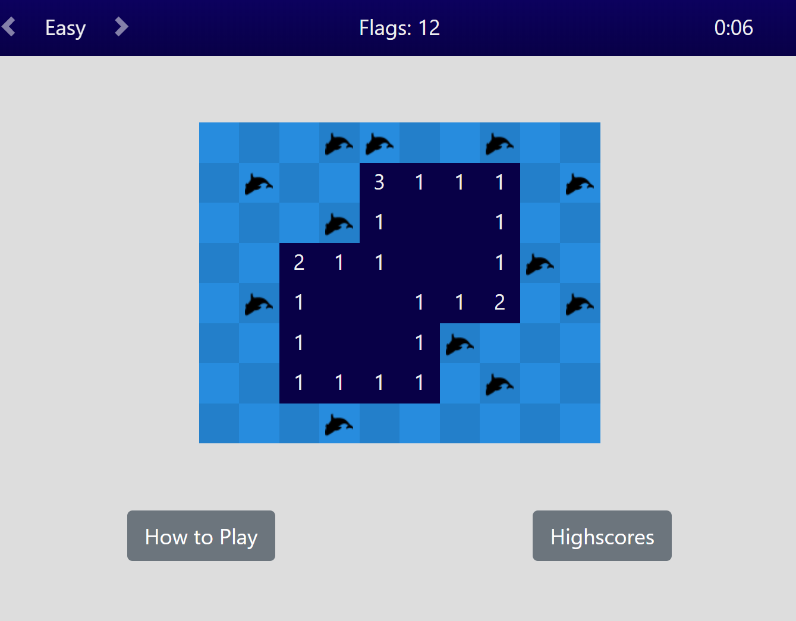

# Find The Orcas

This application is a recreation of classic Minesweeper using JavaScript. This was done as an exercise in logic and JavaScript utiliy.

## Functionality

The user can select a difficulty level, and a game board will be generated based on their selection. They can click any square on the game board, and the contents of the square will be revealed. If the user clicks an orca (bomb), the game ends. Otherwise, the number of orcas in adjacent squares is revealed. If there are no orcas in any adjacent squares, the contents of all adjacent squares are revealed as well.

The user may save their scores in local storage.

Bootstrap was utilized for some layout compenents of this webpage.

## Screenshot
